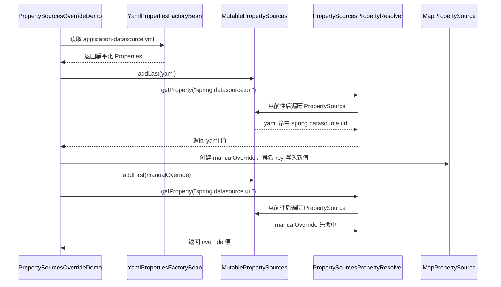
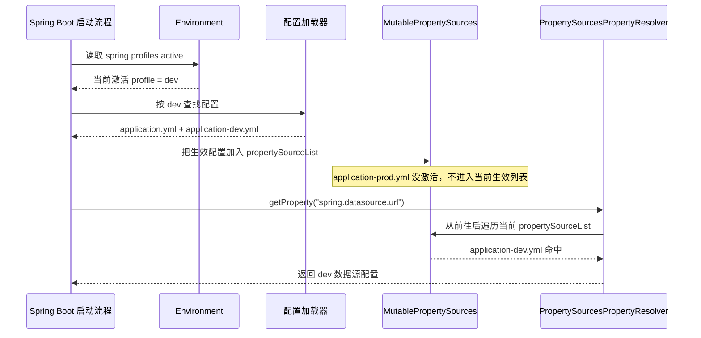

# PropertySources 覆盖流程

## 一句话理解

`PropertySources` 是一组有顺序的 `PropertySource`。Spring 查配置时从前往后找，谁先返回非 `null`，谁就生效。

所以你在 yaml 里配置了数据源，又想自己加一个配置覆盖它，核心就是把自己的 `PropertySource` 放到 yaml 前面：

```java
propertySources.addFirst(new MapPropertySource("manualOverride", override));
```

如果放到后面：

```java
propertySources.addLast(new MapPropertySource("manualOverride", override));
```

同名 key 会先被 yaml 命中，你的配置就覆盖不了 yaml。

## 本示例位置

代码：

```text
spring-debug/src/main/java/cn/totoro7/propertysource/PropertySourcesOverrideDemo.java
```

yaml：

```text
spring-debug/src/main/resources/application-datasource.yml
```

运行：

```powershell
.\gradlew.bat :spring-debug:propertySourcesDemo
```

## 示例里的数据源配置

yaml 里先放默认值：

```yaml
spring:
  datasource:
    url: jdbc:mysql://yaml-host:3306/yaml_db
    username: yaml_user
    password: yaml_password
```

然后代码里手动加一个更高优先级的配置源：

```java
override.put("spring.datasource.url", "jdbc:mysql://override-host:3306/override_db");
override.put("spring.datasource.username", "override_user");
propertySources.addFirst(new MapPropertySource("manualOverride", override));
```

最终结果：

```text
spring.datasource.url      -> manualOverride
spring.datasource.username -> manualOverride
spring.datasource.password -> yaml
```

因为自定义配置只覆盖了 `url` 和 `username`，没有配置 `password`，所以 `password` 会继续从 yaml 里取。

## 执行时序图



## 对应源码主线

1. `MutablePropertySources` 内部维护一个 `propertySourceList`。
2. `addFirst` 把新的 `PropertySource` 放到列表最前面。
3. `PropertySourcesPropertyResolver#getProperty` 遍历 `propertySources`。
4. 某个 `PropertySource#getProperty(key)` 返回非 `null` 后，直接返回这个值。
5. 后面的同名 key 不会再参与本次解析。

## 和 Spring Boot 的关系

这个仓库是 Spring Framework，`application.yml` 不会像 Spring Boot 那样自动加载。

Spring Boot 会在启动早期把 `application.yml`、环境变量、命令行参数等都放进 `Environment` 的 `PropertySources`。如果你在 Boot 里想覆盖 yaml，本质还是同一个规则：把自己的 `PropertySource` 放到 yaml 前面。

常见入口：

```java
environment.getPropertySources().addFirst(new MapPropertySource("manualOverride", override));
```

放在 `ApplicationContextInitializer` 或 `EnvironmentPostProcessor` 这类足够早的扩展点里，才能影响后续 Bean 创建和属性绑定。

## 多个 YAML 和 profile 激活

先记住一句话：

```text
Environment 负责记住当前激活了哪些 profile；
PropertySources 负责保存当前真正生效的配置；
没有激活的配置不会进入最终用于读取配置的 propertySourceList。
```

比如有三个配置文件：

```text
application.yml
application-dev.yml
application-prod.yml
```

如果启动时激活的是 `dev`：

```text
spring.profiles.active=dev
```

那么当前启动真正生效的是：

```text
application.yml
application-dev.yml
```

`application-prod.yml` 没有激活，所以它不会作为当前有效配置加入 `Environment` 的 `PropertySources` 里。

也就是说，最终参与属性解析的是类似这样的列表：

```text
Environment
└─ propertySources
   └─ propertySourceList
      ├─ application-dev.yml
      ├─ application.yml
      ├─ systemProperties
      └─ systemEnvironment
```

不会是这样：

```text
Environment
└─ propertySources
   └─ propertySourceList
      ├─ application-dev.yml
      ├─ application-prod.yml  <- prod 没激活，不应该出现在当前生效配置里
      ├─ application.yml
      └─ ...
```

所以：

```java
environment.getProperty("spring.datasource.url")
```

只会从当前 `propertySourceList` 里面从前往后查。`application-prod.yml` 如果没进入这个列表，就完全不会参与这次查找，也就不可能覆盖 `application-dev.yml`。

## Environment 到底存了什么

`Environment` 里不是把所有没激活的配置都存起来。

它主要做两件事：

1. 记录当前激活的 profile，比如 `dev`。
2. 持有当前生效的 `PropertySources`。

当前激活的 profile 可以通过这个方法拿到：

```java
environment.getActiveProfiles()
```

它底层对应的是 `AbstractEnvironment` 里的 `activeProfiles`：

```text
activeProfiles = ["dev"]
```

配置值本身要能被读取到，必须进入：

```text
Environment -> MutablePropertySources -> propertySourceList
```

所以不要理解成：

```text
Environment 里面保存了 dev、prod、test 所有配置，只是读取时判断用哪个
```

更准确的理解是：

```text
Environment 先知道当前激活 dev；
然后启动流程只把 dev 相关配置变成 PropertySource；
最后 getProperty 只查这些已经生效的 PropertySource。
```

## 当前 Spring Framework 和 Spring Boot 的区别

这个项目是 Spring Framework。Framework 只提供基础组件，比如：

```text
YamlPropertiesFactoryBean
YamlProcessor
MutablePropertySources
PropertySourcesPropertyResolver
Environment
```

在 Framework 里，`YamlProcessor` 的逻辑很直接：

```text
setResources 传进来哪些 YAML，它就处理哪些 YAML。
```

如果没有设置 `DocumentMatcher`，它不会自动根据 profile 过滤文档。

也就是说，在纯 Framework 里：

```java
factory.setResources(
    new ClassPathResource("application-dev.yml"),
    new ClassPathResource("application-prod.yml")
);
```

这两个文件都会被处理。是否过滤 `prod`，要调用方自己写匹配规则。

Spring Boot 则是在 Framework 之上多做了一层启动配置加载：

```text
1. 先确定 spring.profiles.active 是什么
2. 再根据 active profile 找应该生效的配置文件
3. 把生效配置包装成 PropertySource
4. 放进 Environment.propertySources.propertySourceList
5. Bean 创建、@Value、@ConfigurationProperties 再从这里读配置
```

所以我们平时在 Boot 里看到的：

```text
application-dev.yml 自动生效
application-prod.yml 自动不生效
```

这是 Boot 帮我们做的，不是 `PropertySourcesPropertyResolver` 自己做的。

`PropertySourcesPropertyResolver` 只负责一件事：

```text
从 propertySourceList 前往后查 key，第一个非 null 值直接返回。
```

## 未激活配置文件会不会被加载

通俗一点说，要分两种“加载”：

```text
被发现/被检查过      不等于    进入当前生效配置
```

Spring Boot 启动时，可能会根据命名规则、位置、profile 信息去找配置文件，也可能判断某个 profile 文档是否匹配。

但是没激活的配置不会进入最终生效的 `propertySourceList`。

因此没激活的配置：

```text
不会被 environment.getProperty(...) 读取到
不会参与同名 key 覆盖
不会影响 @Value
不会影响 @ConfigurationProperties
不会影响自动配置里读取到的属性值
```

比如：

```yaml
# application-dev.yml
spring:
  datasource:
    url: jdbc:mysql://dev-host:3306/dev_db
```

```yaml
# application-prod.yml
spring:
  datasource:
    url: jdbc:mysql://prod-host:3306/prod_db
```

启动参数：

```text
--spring.profiles.active=dev
```

那么最终：

```java
environment.getProperty("spring.datasource.url")
```

拿到的是：

```text
jdbc:mysql://dev-host:3306/dev_db
```

`prod` 里的值不会参与竞争。

## profile 激活时序图



## 最终结论

可以按这个模型理解：

```text
activeProfiles 决定哪些 profile 配置有资格生效；
propertySourceList 保存当前已经生效的配置源；
getProperty 只查 propertySourceList；
没有激活的配置文件不在 propertySourceList 里，所以不会影响当前启动。
```
