# Spring Bean 加载流程 Debug 文档

这份文档配合当前项目源码和 `spring-debug` 示例一起看。建议先跑示例，再按下面的源码位置打断点。

## 一句话先抓主线

Spring Bean 加载可以拆成两个阶段：

1. **BeanDefinition 阶段**：把 XML、注解等配置解析成 `BeanDefinition`，放进 `DefaultListableBeanFactory` 的 `beanDefinitionMap`。
2. **Bean 实例阶段**：容器刷新后半段，通过 `getBean()` 根据 `BeanDefinition` 创建真正的 Java 对象，并放进单例缓存。

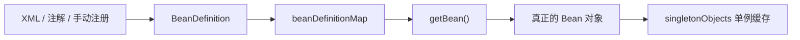

可以把 `BeanDefinition` 理解成“施工图纸”，Bean 对象才是“盖出来的房子”。前半段主要处理图纸，后半段才真正造对象。

## 示例代码位置

示例都放在 `spring-debug` 里：

| 文件 | 作用 |
| --- | --- |
| `spring-debug/src/main/java/cn/totoro7/beanloading/BeanLoadingDebugDemo.java` | 调试入口，启动 `ClassPathXmlApplicationContext` |
| `spring-debug/src/main/resources/bean-loading-debug.xml` | XML Bean 配置 |
| `spring-debug/src/main/java/cn/totoro7/beanloading/OrderService.java` | 被创建的业务 Bean，包含构造、属性注入、Aware、初始化、销毁 |
| `spring-debug/src/main/java/cn/totoro7/beanloading/OrderRepository.java` | 被 `OrderService` 依赖的 Bean |
| `spring-debug/src/main/java/cn/totoro7/beanloading/CircularA.java` | setter 循环依赖示例 A |
| `spring-debug/src/main/java/cn/totoro7/beanloading/CircularB.java` | setter 循环依赖示例 B |
| `spring-debug/src/main/java/cn/totoro7/beanloading/BeanLoadingBeanFactoryPostProcessor.java` | 演示 BeanDefinition 阶段修改属性 |
| `spring-debug/src/main/java/cn/totoro7/beanloading/BeanLoadingBeanPostProcessor.java` | 演示 Bean 初始化前后拦截 |

运行方式：

```bash
./gradlew.bat :spring-debug:beanLoadingDemo
```

也可以直接在 IDEA 运行 `BeanLoadingDebugDemo#main`，这样打断点更方便。

## 示例里能看到什么

`bean-loading-debug.xml` 里声明了几个关键 Bean：

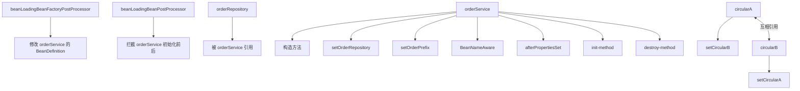

注意 `orderService` 在 XML 里写的是 `orderPrefix=XML-ORDER`，但 `BeanLoadingBeanFactoryPostProcessor` 会在普通 Bean 创建前把它改成 `BFPP-ORDER`。这说明 BFPP 处理的是 `BeanDefinition`，不是已经创建好的对象。

## 建议断点顺序

按这个顺序打断点，基本能串起完整流程：

| 顺序 | 源码位置 | 方法 | 看什么 |
| --- | --- | --- | --- |
| 1 | `spring-context/src/main/java/org/springframework/context/support/ClassPathXmlApplicationContext.java` | 构造方法 | XML 路径如何传入 |
| 2 | `spring-context/src/main/java/org/springframework/context/support/AbstractApplicationContext.java` | `refresh()` | 容器刷新总入口 |
| 3 | `spring-context/src/main/java/org/springframework/context/support/AbstractRefreshableApplicationContext.java` | `refreshBeanFactory()` | 创建 `DefaultListableBeanFactory` |
| 4 | `spring-context/src/main/java/org/springframework/context/support/AbstractXmlApplicationContext.java` | `loadBeanDefinitions(...)` | 准备 XML 读取器 |
| 5 | `spring-beans/src/main/java/org/springframework/beans/factory/xml/XmlBeanDefinitionReader.java` | `doLoadBeanDefinitions(...)` | XML 转成 `Document`，再注册 BeanDefinition |
| 6 | `spring-beans/src/main/java/org/springframework/beans/factory/xml/DefaultBeanDefinitionDocumentReader.java` | `processBeanDefinition(...)` | `<bean>` 标签转成 `BeanDefinitionHolder` |
| 7 | `spring-beans/src/main/java/org/springframework/beans/factory/support/DefaultListableBeanFactory.java` | `registerBeanDefinition(...)` | 放入 `beanDefinitionMap` |
| 8 | `spring-context/src/main/java/org/springframework/context/support/AbstractApplicationContext.java` | `invokeBeanFactoryPostProcessors(...)` | 执行 BFPP，可以改 BeanDefinition |
| 9 | `spring-context/src/main/java/org/springframework/context/support/AbstractApplicationContext.java` | `registerBeanPostProcessors(...)` | 注册 BPP，等 Bean 初始化时回调 |
| 10 | `spring-context/src/main/java/org/springframework/context/support/AbstractApplicationContext.java` | `finishBeanFactoryInitialization(...)` | 准备创建非懒加载单例 |
| 11 | `spring-beans/src/main/java/org/springframework/beans/factory/support/DefaultListableBeanFactory.java` | `preInstantiateSingletons()` | 遍历 BeanDefinition 名称，触发 `getBean()` |
| 12 | `spring-beans/src/main/java/org/springframework/beans/factory/support/AbstractBeanFactory.java` | `doGetBean(...)` | 查缓存、合并 BeanDefinition、按 scope 创建 |
| 13 | `spring-beans/src/main/java/org/springframework/beans/factory/support/AbstractAutowireCapableBeanFactory.java` | `doCreateBean(...)` | 实例化、属性填充、初始化 |
| 14 | `spring-beans/src/main/java/org/springframework/beans/factory/support/AbstractAutowireCapableBeanFactory.java` | `populateBean(...)` | 执行属性注入 |
| 15 | `spring-beans/src/main/java/org/springframework/beans/factory/support/AbstractAutowireCapableBeanFactory.java` | `initializeBean(...)` | Aware、BPP、初始化方法 |
| 16 | `spring-beans/src/main/java/org/springframework/beans/factory/support/DefaultSingletonBeanRegistry.java` | `getSingleton(String, boolean)` | 循环依赖时从三级缓存拿提前暴露引用 |
| 17 | `spring-beans/src/main/java/org/springframework/beans/factory/support/DefaultSingletonBeanRegistry.java` | `addSingletonFactory(...)` | 把 ObjectFactory 放进三级缓存 |
| 18 | `spring-beans/src/main/java/org/springframework/beans/factory/support/DefaultSingletonBeanRegistry.java` | `addSingleton(...)` | Bean 创建完成后进入一级缓存 |

## 总流程图

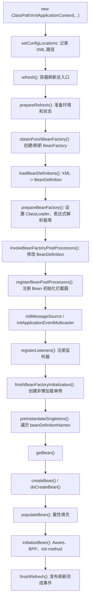

## refresh 的关键步骤

`AbstractApplicationContext#refresh()` 是主入口。你可以把它看成容器启动的总调度。

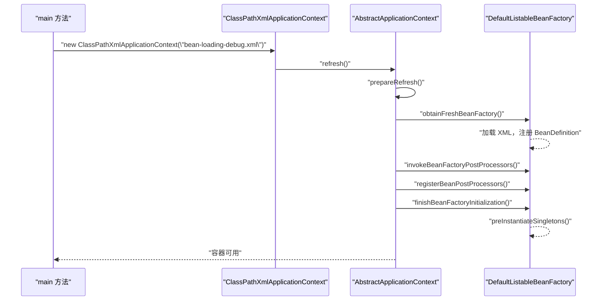

这里最容易混淆的是：

- `obtainFreshBeanFactory()` 主要是准备 BeanFactory，并把配置加载成 `BeanDefinition`。
- `finishBeanFactoryInitialization()` 才开始批量创建非懒加载单例 Bean。

## XML 到 BeanDefinition

XML 解析主线如下：

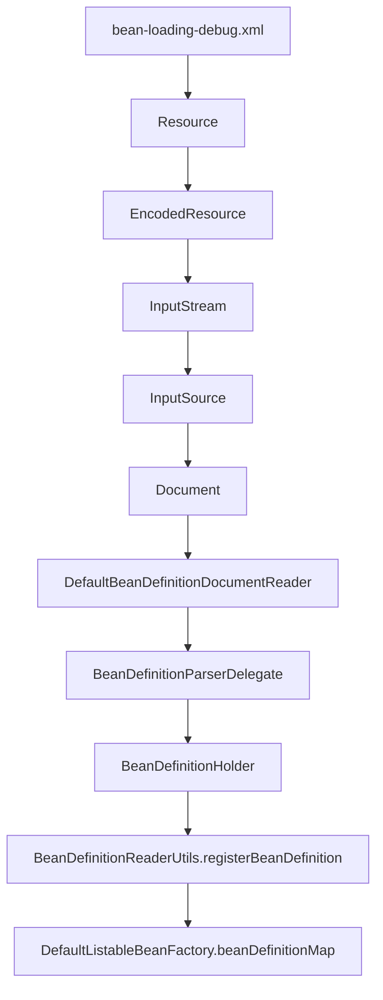

核心源码：

- `AbstractXmlApplicationContext#loadBeanDefinitions(DefaultListableBeanFactory)`
- `XmlBeanDefinitionReader#loadBeanDefinitions(EncodedResource)`
- `XmlBeanDefinitionReader#doLoadBeanDefinitions(InputSource, Resource)`
- `DefaultBeanDefinitionDocumentReader#parseBeanDefinitions(...)`
- `DefaultBeanDefinitionDocumentReader#processBeanDefinition(...)`
- `BeanDefinitionParserDelegate#parseBeanDefinitionElement(...)`
- `BeanDefinitionReaderUtils#registerBeanDefinition(...)`
- `DefaultListableBeanFactory#registerBeanDefinition(...)`

这一阶段只是把配置变成元数据，例如：

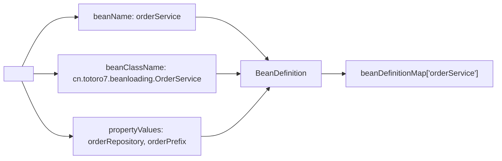

这时 `OrderService` 的构造方法还没有执行。

## BeanFactoryPostProcessor 做什么

`BeanFactoryPostProcessor` 发生在 BeanDefinition 已经加载完成、普通 Bean 还没创建之前。

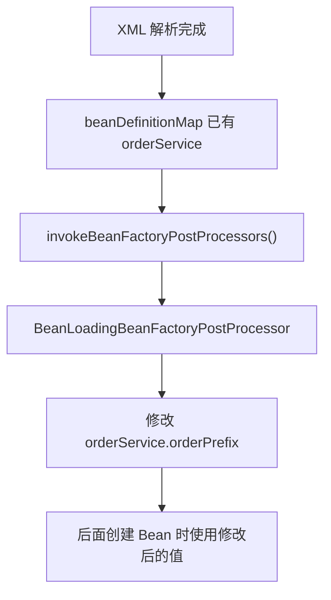

示例里的 `BeanLoadingBeanFactoryPostProcessor` 把 `orderService` 的 `orderPrefix` 从 `XML-ORDER` 改成 `BFPP-ORDER`。所以最终属性填充时进入 `setOrderPrefix` 的值是 `BFPP-ORDER`。

重点：

- BFPP 改的是 `BeanDefinition`。
- BFPP 适合改 Bean 的定义信息，比如属性值、scope、是否 lazy。
- BFPP 不适合处理已经创建好的 Bean，因为普通 Bean 此时通常还没创建。

## BeanPostProcessor 做什么

`BeanPostProcessor` 是 Bean 实例化、属性填充之后，在初始化方法前后回调。

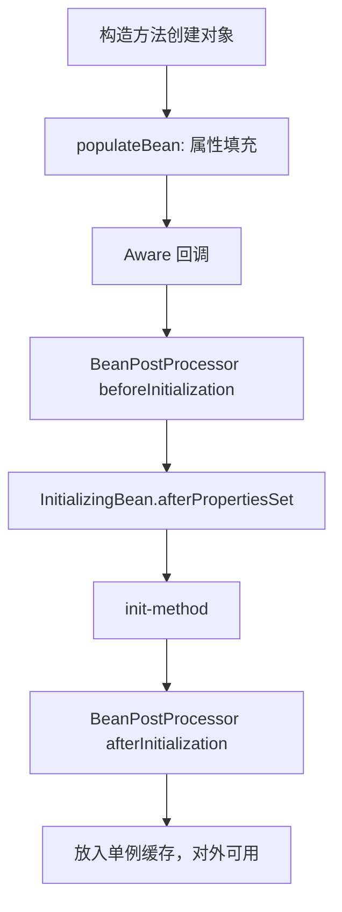

重点：

- BPP 改的是 Bean 对象。
- AOP 代理通常会出现在 BPP 这类扩展点里。
- `postProcessAfterInitialization` 返回的对象可能已经不是原始对象，而是代理对象。

## 创建非懒加载单例

`finishBeanFactoryInitialization()` 最后会调用：

- `DefaultListableBeanFactory#preInstantiateSingletons()`

这个方法会遍历 `beanDefinitionNames`，找出非抽象、单例、非懒加载的 Bean，然后触发 `getBean(beanName)`。

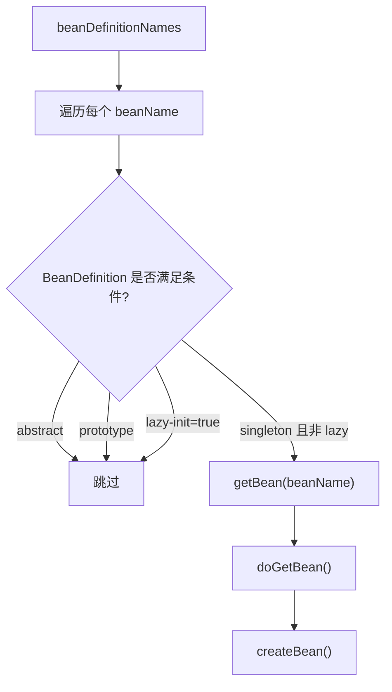

所以不是所有 Bean 都会在启动时创建：

| Bean 类型 | 启动时是否创建 |
| --- | --- |
| 默认 singleton 且非 lazy | 会 |
| `lazy-init=true` | 不会，第一次 `getBean()` 才创建 |
| prototype | 不会，每次 `getBean()` 创建新对象 |
| BeanFactoryPostProcessor | 会提前创建，因为容器要执行它 |
| BeanPostProcessor | 会提前创建，因为容器要注册它 |

## getBean 的内部逻辑

`AbstractBeanFactory#doGetBean(...)` 是 `getBean()` 的核心。

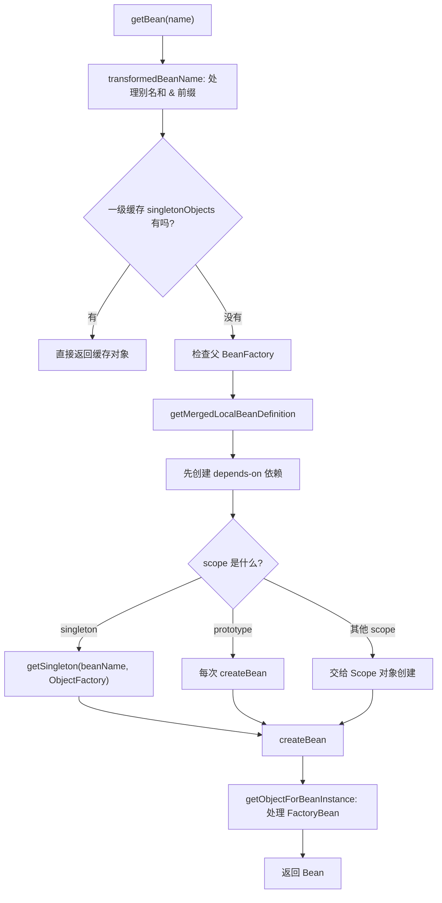

默认单例 Bean 第二次 `getBean("orderService")` 时，会从单例缓存直接拿，不会重新走构造方法。

## doCreateBean 的内部逻辑

`AbstractAutowireCapableBeanFactory#doCreateBean(...)` 是真正创建普通 Bean 的核心。

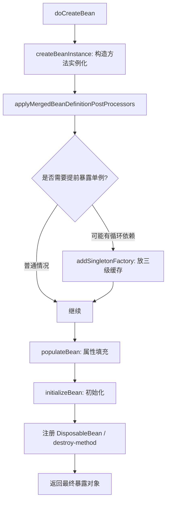

示例里 `OrderService` 会依次看到：

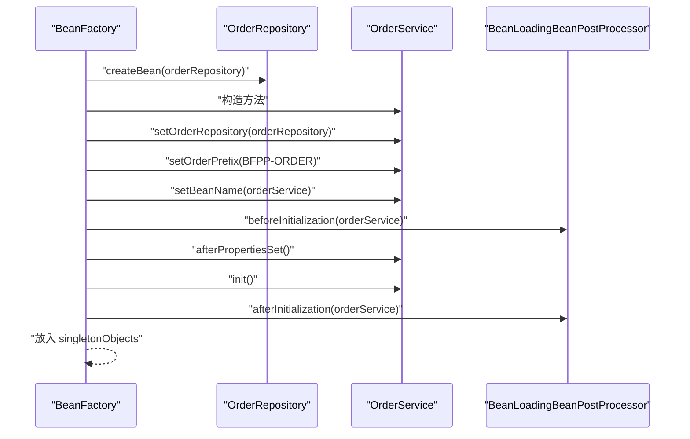

## 属性填充 populateBean

`populateBean(...)` 负责给已经构造出来的对象设置属性。

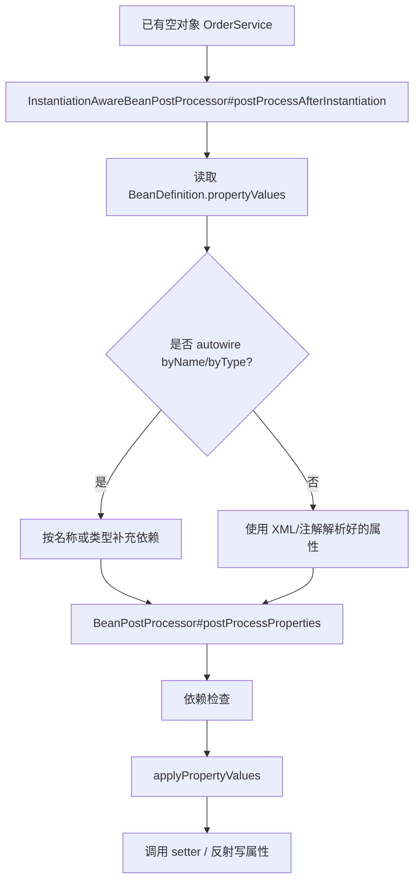

示例里的两个属性：

- `orderRepository` 是 `ref`，会先拿到 `OrderRepository` Bean，再注入。
- `orderPrefix` 是普通字符串属性，但被 BFPP 改成了 `BFPP-ORDER`。

## 初始化 initializeBean

`initializeBean(...)` 负责调用各种初始化扩展点。

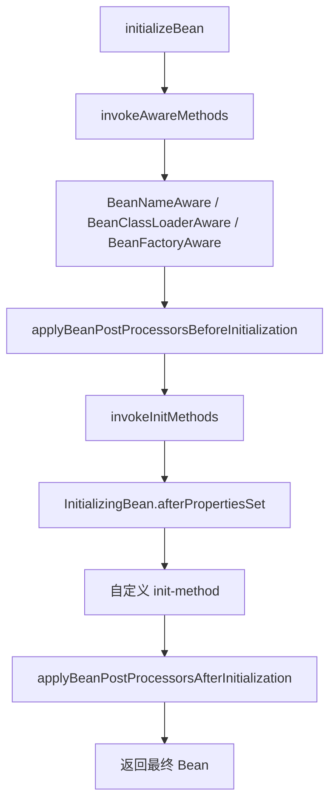

注意顺序：

1. Aware 回调
2. BPP 初始化前
3. `afterPropertiesSet`
4. 自定义 `init-method`
5. BPP 初始化后

如果后面看 AOP，重点关注 BPP 初始化后返回的对象，因为那里可能返回代理。

## 单例缓存和循环依赖

普通单例最终会进入 `DefaultSingletonBeanRegistry` 的缓存。先理解最常用的一级缓存：

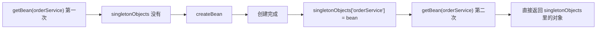

`DefaultSingletonBeanRegistry` 里和单例缓存直接相关的是三个 Map：

| 缓存 | 源码字段 | 存什么 | 什么时候用 |
| --- | --- | --- | --- |
| 一级缓存 | `singletonObjects` | 完整初始化后的单例 Bean | 正常 `getBean()` 优先查这里 |
| 二级缓存 | `earlySingletonObjects` | 已经提前暴露过的早期 Bean 引用 | 解决循环依赖时复用早期引用 |
| 三级缓存 | `singletonFactories` | `ObjectFactory<?>`，需要时生成早期引用 | Bean 实例化后、属性填充前放入 |

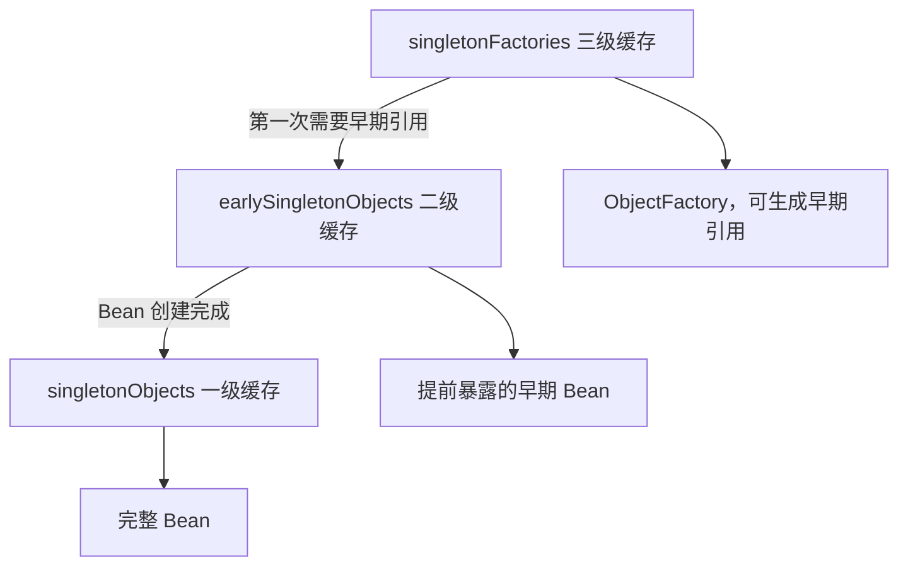

### 循环依赖示例

示例 XML 里加了两个默认单例：

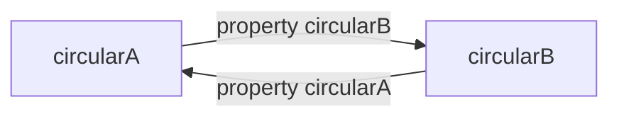

对应代码：

- `spring-debug/src/main/java/cn/totoro7/beanloading/CircularA.java`
- `spring-debug/src/main/java/cn/totoro7/beanloading/CircularB.java`
- `spring-debug/src/main/resources/bean-loading-debug.xml`

这是 Spring 默认能解决的情况：**singleton + setter 注入循环依赖**。

不能按这个机制解决的典型情况：

| 场景 | 默认是否能解决 | 原因 |
| --- | --- | --- |
| singleton + setter 循环依赖 | 能 | A 原始对象创建后，可以先提前暴露引用 |
| constructor 构造器循环依赖 | 不能 | A 构造方法还没返回，根本没有可提前暴露的对象 |
| prototype 循环依赖 | 不能 | prototype 不进单例三级缓存 |
| 关闭 `allowCircularReferences` | 不能 | `doCreateBean` 不会提前暴露 `ObjectFactory` |

### setter 循环依赖怎么走

以 `CircularA -> CircularB -> CircularA` 为例：

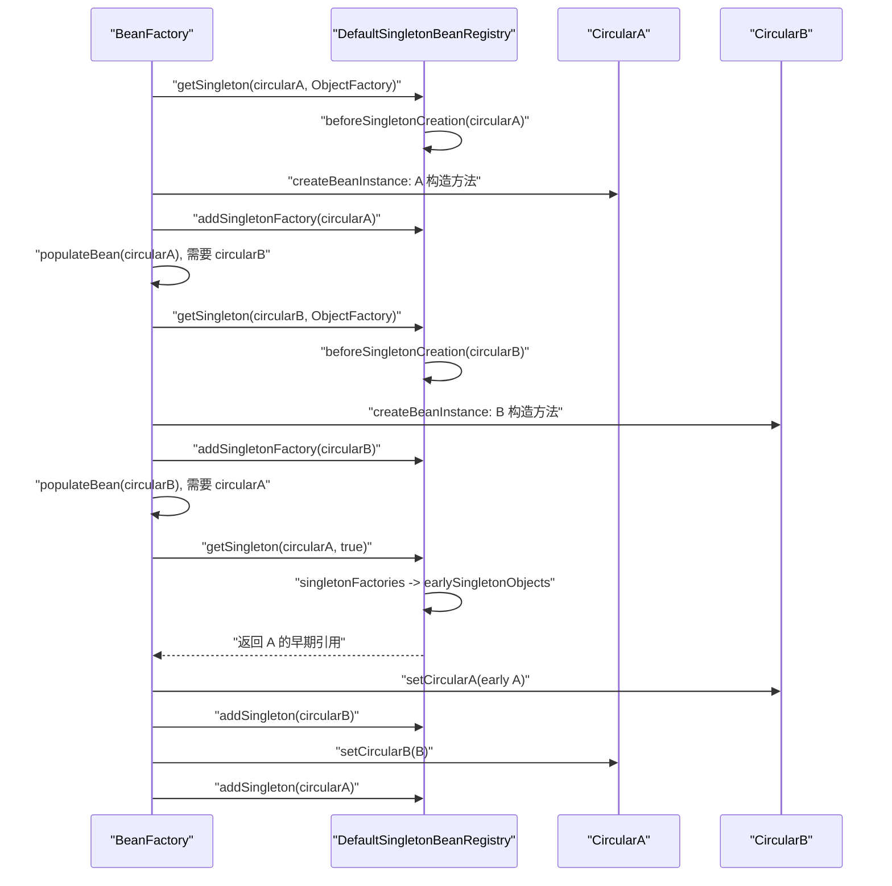

核心源码对应关系：

| 步骤 | 源码位置 | 关键点 |
| --- | --- | --- |
| 标记正在创建 | `DefaultSingletonBeanRegistry#getSingleton(String, ObjectFactory<?>)` | 调用 `beforeSingletonCreation(beanName)` |
| A 构造完成 | `AbstractAutowireCapableBeanFactory#doCreateBean(...)` | `createBeanInstance(...)` 返回原始对象 |
| A 提前暴露 | `AbstractAutowireCapableBeanFactory#doCreateBean(...)` | `addSingletonFactory(beanName, () -> getEarlyBeanReference(...))` |
| B 注入 A | `DefaultSingletonBeanRegistry#getSingleton(String, boolean)` | 从三级缓存拿 `ObjectFactory`，生成早期引用，放入二级缓存 |
| 创建完成 | `DefaultSingletonBeanRegistry#addSingleton(...)` | 放入一级缓存，移除二级、三级缓存 |

### 为什么需要三级缓存

如果只有一级缓存，A 没初始化完成之前不能放进去，B 就拿不到 A。

如果只有二级缓存，Spring 只能提前放一个原始 A；但实际项目里 A 可能被 AOP 包装成代理对象，B 注入原始 A 就会和容器最终暴露的代理对象不一致。

三级缓存存的是 `ObjectFactory`，需要早期引用时才调用：

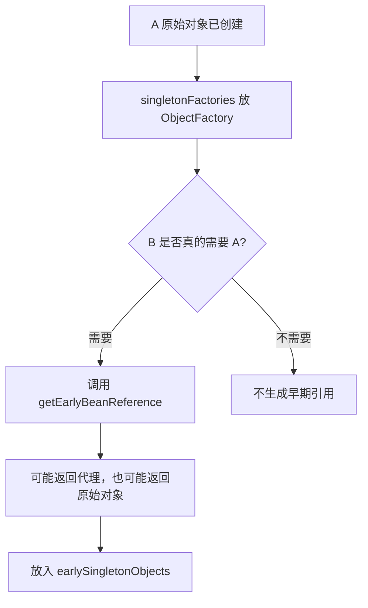

设计上的收益是：**把“是否提前暴露”和“暴露原始对象还是代理对象”延迟到真正需要的时候决定**。这也是 AOP 和循环依赖能尽量兼容的关键。

### 看循环依赖建议打的断点

只看 `circularA/circularB` 时，建议临时在这些方法里加条件断点：

| 方法 | 条件建议 |
| --- | --- |
| `DefaultSingletonBeanRegistry#getSingleton(String, ObjectFactory<?>)` | `beanName.equals("circularA") || beanName.equals("circularB")` |
| `AbstractAutowireCapableBeanFactory#doCreateBean(...)` | `beanName.equals("circularA") || beanName.equals("circularB")` |
| `DefaultSingletonBeanRegistry#addSingletonFactory(...)` | `beanName.equals("circularA") || beanName.equals("circularB")` |
| `DefaultSingletonBeanRegistry#getSingleton(String, boolean)` | `beanName.equals("circularA") || beanName.equals("circularB")` |
| `DefaultSingletonBeanRegistry#addSingleton(...)` | `beanName.equals("circularA") || beanName.equals("circularB")` |

第一次看 Bean 加载流程时，不建议一开始就陷进三级缓存。先把“XML -> BeanDefinition -> getBean -> doCreateBean -> singletonObjects”走通，再回头看循环依赖会轻松很多。

## BeanDefinition 和 Bean 对象的区别

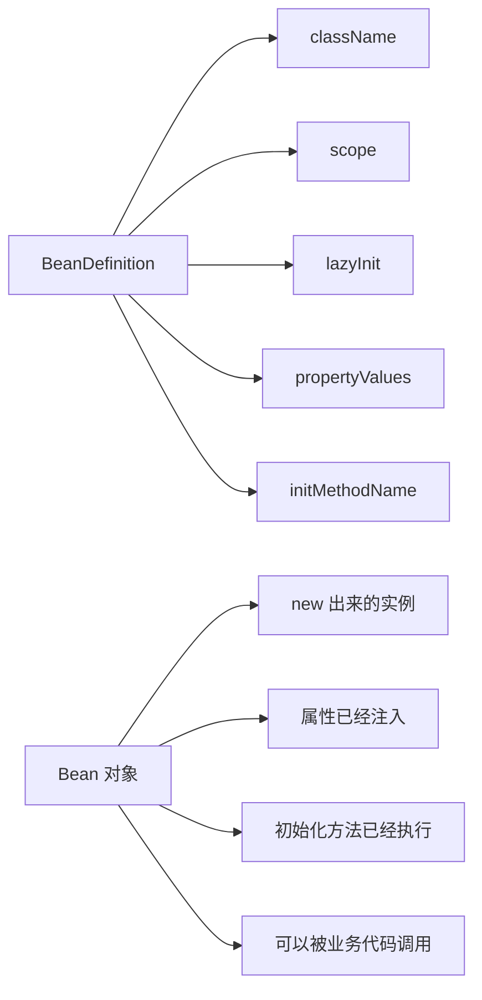

判断一个断点在哪个阶段，可以问一句：

- 这里操作的是 `BeanDefinition`、`BeanDefinitionHolder`、`BeanDefinitionMap` 吗？如果是，就是定义阶段。
- 这里操作的是 `OrderService` 这种真实对象吗？如果是，就是实例阶段。

## XML 版和注解版的关系

这份示例用 XML，因为 XML 主线最直观：

```mermaid
flowchart TD
	A["XML 方式"] --> B["XmlBeanDefinitionReader"]
	B --> C["BeanDefinition"]
	C --> D["DefaultListableBeanFactory"]
	D --> E["getBean / createBean"]

	F["注解方式"] --> G["AnnotatedBeanDefinitionReader / ClassPathBeanDefinitionScanner"]
	G --> C
```

也就是说，XML 和注解前面的“读取配置”方式不一样，但后面都会汇入：

- `DefaultListableBeanFactory`
- `BeanDefinition`
- `getBean()`
- `createBean()`
- `populateBean()`
- `initializeBean()`

后半段创建 Bean 的主流程是共用的。

## 这套设计的好处

Spring Bean 加载流程看起来长，但结构很清楚：先统一成 `BeanDefinition`，再统一创建 Bean。

```mermaid
flowchart TD
	A["不同配置来源"] --> B["统一 BeanDefinition"]
	B --> C["统一 BeanFactory"]
	C --> D["统一 Bean 生命周期"]
	D --> E["统一扩展点"]
```

这种设计有几个明显好处：

| 设计点 | 好处 |
| --- | --- |
| 配置读取和 Bean 创建分离 | XML、注解、手动注册都能复用后面的创建流程 |
| `BeanDefinition` 作为中间模型 | 框架可以在对象创建前修改定义，例如 BFPP、BDRPP |
| `BeanPostProcessor` 统一拦截生命周期 | AOP、`@Autowired`、`@PostConstruct` 等能力不用侵入业务类 |
| 单例缓存集中在 `DefaultSingletonBeanRegistry` | `getBean()`、循环依赖、销毁顺序有统一管理点 |
| `refresh()` 拆成多个模板步骤 | 子类和扩展点可以插入逻辑，但主流程不乱 |

这就是 Spring 容器能同时支持 XML、注解、AOP、事件、国际化、自定义 scope 的原因：主流程稳定，扩展点分层。

## 自研调整和扩展建议

如果后续做 Spring 框架自研调整，优先用现有扩展点，不要直接改 `doCreateBean()` 这类核心方法。核心方法改错一次，所有 Bean 都会受影响。

```mermaid
flowchart TD
	A["想扩展 Spring Bean 加载"] --> B{"改哪个阶段?"}
	B -->|"配置读取阶段"| C["BeanDefinitionReader / NamespaceHandler"]
	B -->|"定义修改阶段"| D["BeanDefinitionRegistryPostProcessor / BeanFactoryPostProcessor"]
	B -->|"实例化前后"| E["InstantiationAwareBeanPostProcessor / SmartInstantiationAwareBeanPostProcessor"]
	B -->|"属性注入阶段"| F["postProcessProperties / AutowireCandidateResolver"]
	B -->|"初始化前后"| G["BeanPostProcessor"]
	B -->|"scope 生命周期"| H["Scope / DisposableBean / SmartInitializingSingleton"]
```

常见扩展位置：

| 需求 | 推荐扩展点 | 不建议直接改 |
| --- | --- | --- |
| 新增一种配置格式 | `BeanDefinitionReader` | `DefaultListableBeanFactory` |
| XML 自定义标签 | `NamespaceHandler`、`BeanDefinitionParser` | XML 主解析流程 |
| 动态注册 BeanDefinition | `BeanDefinitionRegistryPostProcessor` | `refresh()` |
| 启动前批量改属性、scope、lazy | `BeanFactoryPostProcessor` | `doCreateBean()` |
| 自定义依赖注入逻辑 | `InstantiationAwareBeanPostProcessor#postProcessProperties` | `populateBean()` |
| 自定义 AOP 或代理 | `SmartInstantiationAwareBeanPostProcessor`、`BeanPostProcessor` | 单例缓存逻辑 |
| 自定义作用域 | `Scope` | `doGetBean()` |
| Bean 创建后统一校验 | `BeanPostProcessor#postProcessAfterInitialization` | 业务 Bean 构造方法 |

几个实践建议：

- 想改“图纸”，优先找 `BeanDefinition` 阶段的扩展点。
- 想改“对象”，优先找 `BeanPostProcessor`。
- 想支持循环依赖里的代理一致性，要关注 `getEarlyBeanReference(...)`，否则容易出现 A 注入原始对象、容器最终暴露代理对象的问题。
- 想禁止循环依赖，优先通过 `setAllowCircularReferences(false)` 这类开关控制，不要删除三级缓存逻辑。
- 自研容器时也建议保留“定义阶段”和“实例阶段”的分层，否则后续加注解扫描、代理、scope 会很难扩展。

## 源码真实性复核

这份文档对应当前源码主线，重点关系如下：

| 文档结论 | 当前源码对应 |
| --- | --- |
| XML 先变成 `BeanDefinition` | `XmlBeanDefinitionReader#doLoadBeanDefinitions` -> `DefaultBeanDefinitionDocumentReader#processBeanDefinition` |
| `BeanDefinition` 注册进容器 | `BeanDefinitionReaderUtils#registerBeanDefinition` -> `DefaultListableBeanFactory#registerBeanDefinition` |
| 非懒加载单例在刷新后半段创建 | `AbstractApplicationContext#finishBeanFactoryInitialization` -> `DefaultListableBeanFactory#preInstantiateSingletons` |
| `getBean()` 先查单例缓存 | `AbstractBeanFactory#doGetBean` -> `DefaultSingletonBeanRegistry#getSingleton(String)` |
| 单例创建成功后进入一级缓存 | `DefaultSingletonBeanRegistry#getSingleton(String, ObjectFactory<?>)` -> `addSingleton(...)` |
| setter 循环依赖靠提前暴露 | `AbstractAutowireCapableBeanFactory#doCreateBean` -> `addSingletonFactory(...)` |
| 早期引用从三级缓存迁到二级缓存 | `DefaultSingletonBeanRegistry#getSingleton(String, boolean)` |
| 初始化流程包含 Aware、BPP、init | `AbstractAutowireCapableBeanFactory#initializeBean` |

如果 debug 时发现调用栈和文档不一致，优先确认当前 Bean 是不是特殊 Bean，例如 `FactoryBean`、`BeanPostProcessor`、懒加载 Bean、prototype Bean，或者是不是注解扫描路径而不是 XML 路径。

## 常见问题

### 1. XML 加载完是不是 Bean 就创建好了？

不是。XML 加载完主要是注册了 `BeanDefinition`。普通非懒加载单例要到 `finishBeanFactoryInitialization()` 里的 `preInstantiateSingletons()` 才会批量创建。

### 2. BeanFactoryPostProcessor 和 BeanPostProcessor 有什么区别？

```mermaid
flowchart LR
	A["BeanFactoryPostProcessor"] --> B["处理 BeanDefinition"]
	B --> C["发生在普通 Bean 创建前"]

	D["BeanPostProcessor"] --> E["处理 Bean 对象"]
	E --> F["发生在 Bean 初始化前后"]
```

一句话：BFPP 改图纸，BPP 改成品。

### 3. 为什么有些 Bean 会提前创建？

因为容器自己启动也需要一些特殊 Bean，例如：

- `BeanFactoryPostProcessor`
- `BeanDefinitionRegistryPostProcessor`
- `BeanPostProcessor`
- `LoadTimeWeaverAware`

这些 Bean 可能会在普通业务 Bean 之前被创建。

### 4. 为什么 `getBean()` 有时没有进入构造方法？

默认单例第一次创建后会放入缓存。后续 `getBean()` 直接从 `singletonObjects` 返回，所以不会再次执行构造方法。

## 推荐的 Debug 路线

第一次 debug 不要所有断点都开，建议分三轮：

```mermaid
flowchart TD
	A["第一轮：只看 refresh 主流程"] --> B["refresh"]
	B --> C["obtainFreshBeanFactory"]
	C --> D["finishBeanFactoryInitialization"]

	E["第二轮：只看 XML 解析"] --> F["loadBeanDefinitions"]
	F --> G["processBeanDefinition"]
	G --> H["registerBeanDefinition"]

	I["第三轮：只看 Bean 创建"] --> J["preInstantiateSingletons"]
	J --> K["doGetBean"]
	K --> L["doCreateBean"]
	L --> M["populateBean"]
	M --> N["initializeBean"]
```

每一轮只盯一个问题：

- 第一轮：容器启动大步骤是什么？
- 第二轮：配置怎么变成 BeanDefinition？
- 第三轮：BeanDefinition 怎么变成对象？

## 当前源码已补充注释的位置

这次主要在下面这些源码位置补了更偏 debug 的中文注释：

- `spring-context/src/main/java/org/springframework/context/support/AbstractApplicationContext.java`
- `spring-context/src/main/java/org/springframework/context/support/AbstractRefreshableApplicationContext.java`
- `spring-context/src/main/java/org/springframework/context/support/AbstractXmlApplicationContext.java`
- `spring-beans/src/main/java/org/springframework/beans/factory/xml/XmlBeanDefinitionReader.java`
- `spring-beans/src/main/java/org/springframework/beans/factory/xml/DefaultBeanDefinitionDocumentReader.java`
- `spring-beans/src/main/java/org/springframework/beans/factory/xml/BeanDefinitionParserDelegate.java`
- `spring-beans/src/main/java/org/springframework/beans/factory/support/BeanDefinitionReaderUtils.java`
- `spring-beans/src/main/java/org/springframework/beans/factory/support/DefaultListableBeanFactory.java`
- `spring-beans/src/main/java/org/springframework/beans/factory/support/DefaultSingletonBeanRegistry.java`
- `spring-beans/src/main/java/org/springframework/beans/factory/support/AbstractBeanFactory.java`
- `spring-beans/src/main/java/org/springframework/beans/factory/support/AbstractAutowireCapableBeanFactory.java`

这些注释不是完整翻译源码，而是标出“现在处于哪个阶段、下一步应该跟到哪里”。
